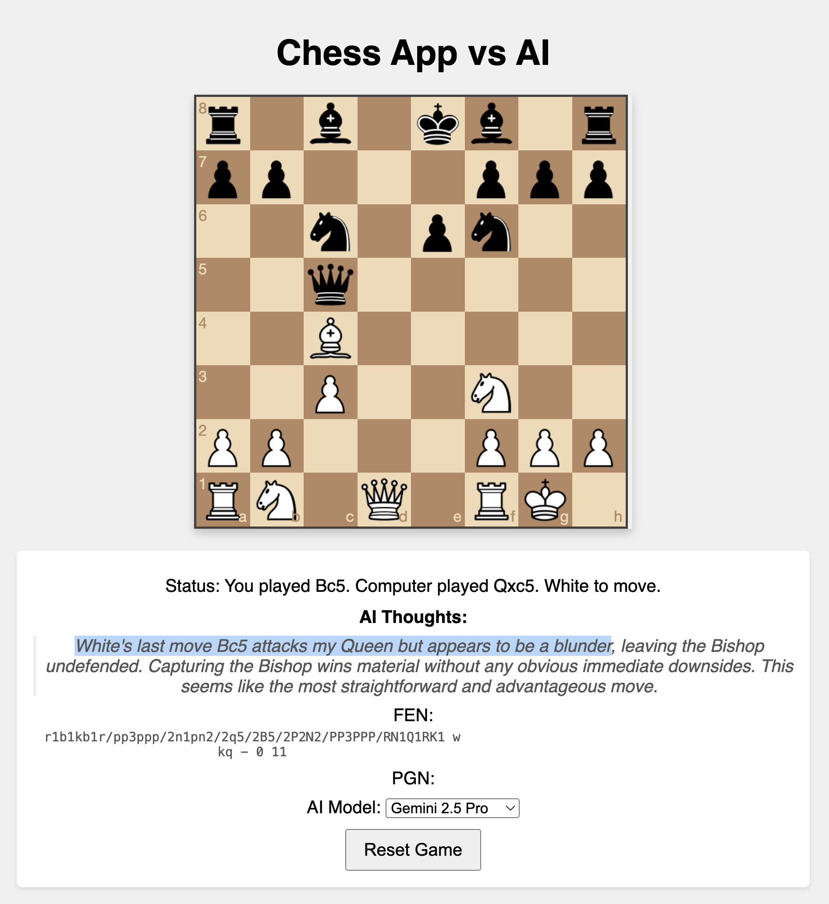

# gemini-chess

Play chess against Google's Gemini models!

This web application was built as an experiment using Google's Gemini 2.5 Pro, primarily through Google AI Studio. The goal was to test Gemini's coding and reasoning capabilities by having it create a chess app, and then using that app to play against the AI itself.

## Features

*   Play a game of chess against various Gemini models (including 2.0 Flash and 2.5 Pro).
*   Simple web interface using HTML, CSS, and JavaScript (`chessboard.js`).
*   Python Flask backend manages game logic and communication with the Gemini API.
*   Optionally, see Gemini's "thoughts" or reasoning behind its moves (available in the `feat/thoughts` branch).

## How it Works

The application uses a simple architecture:
1.  A **Frontend** built with HTML, CSS, and JavaScript (`chessboard.js`, `htmx`) allows the user to interact with the board.
2.  A **Backend** built with Python (Flask) manages the game state (`python-chess`) and communicates with the Gemini API.

When it's the AI's turn, the backend sends the current board state, move history, and a list of legal moves to Gemini. Gemini then selects a move from the legal options, which is played on the board.

## Development Process

This project was largely built with the assistance of Gemini 2.5 Pro. It served as a practical test case for AI-assisted development, starting from architectural planning, generating frontend and backend code, and even debugging. A blog post detailing this process is available (details TBC).
